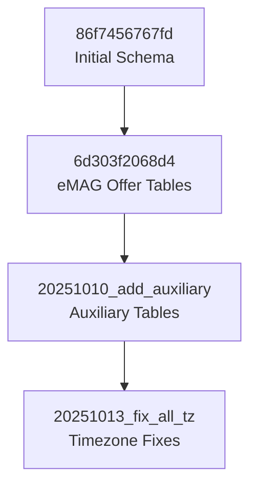

# Status Migrări - Octombrie 2025

## Rezumat

Acest document oferă o vedere de ansamblu asupra tuturor migrărilor din proiect și a stării lor actuale.

**Ultima actualizare**: 13 Octombrie 2025, 13:55 UTC+03:00
**Operații recente**: 3 consolidări consecutive (timezone + redundanță + auxiliary tables)

## Structura Actuală

### Total Fișiere de Migrare: 4 ⭐⭐⭐

```
alembic/versions/
├── 86f7456767fd_initial_database_schema_with_users_.py      (4.4K) - BASE
├── 6d303f2068d4_create_emag_offer_tables.py                 (11K)
├── 20251010_add_auxiliary_tables.py                         (10K) - CONSOLIDAT
└── 20251013_fix_all_timezone_columns.py                     (3.5K) - HEAD
```

**Reducere**: 7 → 4 fișiere (-42.9%) 🎉🎉🎉

## Lanțul de Revisions



**Note**:
- `b1234f5d6c78` (metadata column) - eliminată ca redundantă
- `4242d9721c62` + `97aa49837ac6` - consolidate în `20251010_add_auxiliary`

## Detalii Migrări

### 1. Initial Database Schema (86f7456767fd)
- **Status**: Base migration
- **Data**: 2025-09-24
- **Scop**: Crearea completă a schemei inițiale
- **Conține**:
  - Toate tipurile ENUM
  - Toate tabelele de bază
  - Indecși și constraints
  - Date seed pentru roles și permissions
- **Caracteristici speciale**:
  - Error handling pentru race conditions
  - Verificări de existență pentru tabele
  - Idempotentă

### 2. Create eMAG Offer Tables (6d303f2068d4)
- **Status**: Active
- **Data**: 2025-09-25
- **Scop**: Tabele pentru integrarea eMAG
- **Conține**:
  - `emag_product_offers`
  - `emag_order_items`
  - `emag_orders`
  - Relații și constraints specifice eMAG

### 3. Add Auxiliary Tables (20251010_add_auxiliary) ⭐ CONSOLIDAT
- **Status**: Active (consolidată)
- **Data**: 2025-09-25 / 2025-10-10
- **Scop**: Crearea tabelelor auxiliare
- **Conține**:
  - `audit_logs` - Tracking user actions
  - `product_variants` - Product variations
  - `product_genealogy` - Product lifecycle
- **Caracteristici**:
  - Consolidează 2 migrări anterioare
  - Verificări de dependențe
  - Logging îmbunătățit
  - Error handling în downgrade

### 4. Fix All Timezone Columns (20251013_fix_all_tz) ⭐ CONSOLIDAT
- **Status**: HEAD (consolidată)
- **Data**: 2025-10-13
- **Scop**: Conversie timezone pentru multiple tabele
- **Modifică**:
  - `import_logs`: `started_at`, `completed_at`
  - `product_mappings`: `last_imported_at`
  - `product_supplier_sheets`: 5 coloane datetime
- **Caracteristici**:
  - Consolidează 2 migrări anterioare
  - Verificări robuste
  - Logging detaliat
  - Idempotentă

## Istoric Consolidări

### Consolidare #1: Timezone Fixes (2025-10-13)

**Migrări eliminate:**
1. `20251013_fix_import_logs_timezone.py`
2. `20251013_fix_product_supplier_sheets_tz.py`

**Migrare nouă:**
- `20251013_fix_all_timezone_columns.py`

**Beneficii:**
- Reducere: 2 fișiere → 1 fișier
- Cod mai curat și mai organizat
- Lanț de revisions simplificat

### Consolidare #2: Eliminare Redundanță (2025-10-13)

**Migrări eliminate:**
1. `b1234f5d6c78_add_metadata_column_to_emag_product_offers.py` (REDUNDANT)

**Motiv:**
- Coloana `metadata` era deja creată în `6d303f2068d4_create_emag_offer_tables.py`
- Migrarea încerca să adauge o coloană care deja exista

**Beneficii:**
- Eliminare redundanță 100%
- Lanț de revisions mai clar
- Evitare confuzie în istoric

### Consolidare #3: Tabele Auxiliare (2025-10-13)

**Migrări eliminate:**
1. `4242d9721c62_add_missing_tables.py` (audit_logs)
2. `97aa49837ac6_add_product_relationships_tables.py` (product_variants, product_genealogy)

**Migrare nouă:**
- `20251010_add_auxiliary_tables.py`

**Beneficii:**
- Consolidare: 2 fișiere → 1 fișier
- Grupare logică a tabelelor auxiliare
- Cod mai organizat

### Total Îmbunătățiri Astăzi

**Migrări eliminate**: 5 (4 consolidate + 1 redundantă)
**Reducere totală**: 7 → 4 fișiere (-42.9%)

## Statistici

### Dimensiuni
- **Total**: ~28.9 KB
- **Medie per fișier**: ~7.2 KB
- **Cel mai mare**: `6d303f2068d4_create_emag_offer_tables.py` (11K)
- **Cel mai mic**: `20251013_fix_all_timezone_columns.py` (3.5K)

### Categorii
- **Schema creation**: 1 migrare (25%)
- **Table creation**: 2 migrări (50%)
- **Data type fixes**: 1 migrare (25%)

## Candidați pentru Consolidare Viitoare

### Criterii de Evaluare
✅ **Buni candidați**:
- Migrări mici (<2KB)
- Modificări simple de coloane
- Create în aceeași perioadă
- Secvențiale în lanț

❌ **Nu consolida**:
- Migrări mari (>5KB)
- Creări de tabele majore
- Migrări cu logică complexă
- Migrări cu dependențe externe

### Posibili Candidați
1. Viitoare migrări de indecși - pot fi grupate
2. Viitoare modificări simple de coloane - pot fi consolidate

**Notă**: Toate redundanțele actuale au fost eliminate!

## Best Practices

### La Crearea de Migrări Noi

1. **Verificare existență**:
   ```python
   result = conn.execute(sa.text("""
       SELECT EXISTS (...)
   """)).scalar()
   ```

2. **Error handling**:
   ```python
   try:
       # migration code
   except Exception as e:
       print(f"Error: {e}")
   ```

3. **Idempotență**:
   - Verifică starea înainte de modificare
   - Permite rulare multiplă fără efecte adverse

4. **Logging**:
   ```python
   print(f"✅ Created table {table_name}")
   print(f"⏭️  Skipped {table_name} (already exists)")
   ```

### La Consolidare

1. **Verifică dependențele**:
   ```bash
   alembic history --verbose
   ```

2. **Testează local**:
   ```bash
   alembic upgrade head
   alembic downgrade -1
   alembic upgrade head
   ```

3. **Verifică în Docker**:
   ```bash
   docker compose down -v
   docker compose up -d
   ```

## Comenzi Utile

### Verificare Status
```bash
# Vezi istoricul complet
alembic history --verbose

# Vezi migrarea curentă
alembic current

# Verifică validitatea
alembic check
```

### Testing
```bash
# Upgrade la ultima versiune
alembic upgrade head

# Downgrade o versiune
alembic downgrade -1

# Upgrade la o versiune specifică
alembic upgrade 20251013_fix_all_tz

# Vezi SQL fără a executa
alembic upgrade head --sql
```

### Debugging
```bash
# Vezi diferențele între model și DB
alembic check

# Vezi heads-urile disponibile
alembic heads

# Vezi branches
alembic branches
```

## Probleme Cunoscute și Soluții

### 1. Race Conditions la Startup
**Problemă**: Multiple containere rulează migrări simultan

**Soluție**: 
- Retry logic în `docker-entrypoint.sh`
- Verificări de existență în migrări
- Error handling robust

### 2. Timezone Issues
**Problemă**: Coloane datetime fără timezone

**Soluție**:
- Migrare consolidată `20251013_fix_all_tz`
- Conversie la `TIMESTAMP WITH TIME ZONE`
- Verificări înainte de conversie

## Următorii Pași

### Prioritate Înaltă
- [ ] Monitorizare migrări în producție
- [ ] Backup înainte de deploy

### Prioritate Medie
- [ ] Documentare proceduri de rollback
- [ ] Testare automată a migrărilor

### Prioritate Scăzută
- [ ] Identificare noi candidați pentru consolidare
- [ ] Optimizare performanță migrări

## Resurse

### Documentație
- [MIGRATION_CONSOLIDATION_2025_10_13.md](./MIGRATION_CONSOLIDATION_2025_10_13.md)
- [MIGRATION_RACE_CONDITION_FIX_2025_10_13.md](./MIGRATION_RACE_CONDITION_FIX_2025_10_13.md)
- [Alembic Documentation](https://alembic.sqlalchemy.org/)

### Scripts
- `scripts/docker-entrypoint.sh` - Retry logic pentru migrări
- `alembic/env.py` - Configurare Alembic

## Ultima Actualizare

**Data**: 13 Octombrie 2025, 13:55 UTC+03:00
**Operații**: 3 consolidări consecutive (timezone + redundanță + auxiliary)
**Versiune HEAD**: `20251013_fix_all_tz`
**Total migrări**: 4 (reducere de 42.9% față de 7)

---

*Acest document este actualizat automat la fiecare modificare a structurii migrărilor.*
