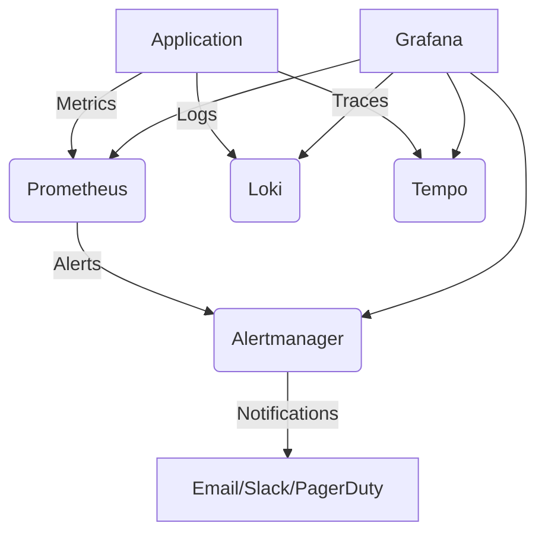
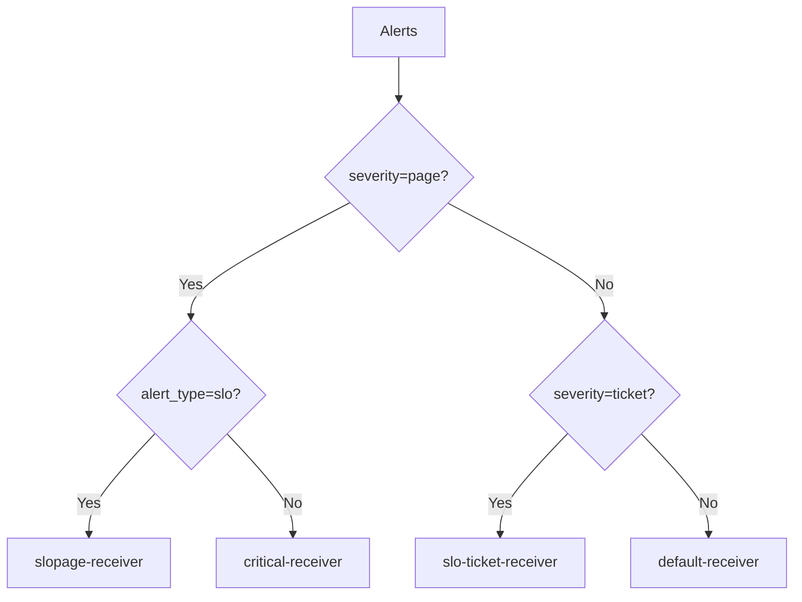

# Alerting and Monitoring Setup

This document describes the alerting and monitoring architecture for the MagFlow system, including SLO-based alerting, dashboard configurations, and operational procedures.

## Table of Contents
1. [Architecture Overview](#architecture-overview)
2. [Alerting Rules](#alerting-rules)
3. [Alertmanager Configuration](#alertmanager-configuration)
4. [Grafana Dashboards](#grafana-dashboards)
5. [Runbooks](#runbooks)
6. [Testing and Validation](#testing-and-validation)
7. [Maintenance and Operations](#maintenance-and-operations)

## Architecture Overview



## Alerting Rules

### SLO-Based Alerts

#### Latency Alerts
1. **HighLatencyFastBurn**
   - **Condition**: p95 latency > 300ms for 5 minutes (14.4x burn rate)
   - **Severity**: page
   - **Window**: 5 minutes
   - **Burn Rate**: 14.4x
   - **Error Budget Impact**: 1% of 30-day budget

2. **HighLatencySlowBurn**
   - **Condition**: p95 latency > 300ms for 1 hour (3.6x burn rate)
   - **Severity**: ticket
   - **Window**: 1 hour
   - **Burn Rate**: 3.6x
   - **Error Budget Impact**: 5% of 30-day budget

#### Error Rate Alerts
3. **HighErrorRateFastBurn**
   - **Condition**: Error rate > 1.44% for 5 minutes (14.4x burn rate)
   - **Severity**: page
   - **Window**: 5 minutes
   - **Burn Rate**: 14.4x
   - **Error Budget Impact**: 1% of 30-day budget

4. **HighErrorRateSlowBurn**
   - **Condition**: Error rate > 0.36% for 1 hour (3.6x burn rate)
   - **Severity**: ticket
   - **Window**: 1 hour
   - **Burn Rate**: 3.6x
   - **Error Budget Impact**: 5% of 30-day budget

### Service Health Alerts
5. **ServiceDegraded**
   - **Condition**: Service is down for 5 minutes
   - **Severity**: page
   - **Window**: 5 minutes

## Alertmanager Configuration

### Routing Tree



### Key Features
- **Grouping**: Alerts are grouped by `alertname`, `service`, `route`, and `method`
- **Inhibition Rules**:
  - Fast burn alerts are suppressed if a slow burn alert is already firing
  - Warning alerts are suppressed if a critical alert is firing for the same service
- **Timing**:
  - `group_wait`: 1 minute
  - `group_interval`: 5 minutes
  - `repeat_interval`: 1 hour (4 hours for slow burn alerts)

## Grafana Dashboards

### SLO Dashboard
- **Location**: `/d/magflow/magflow-slos`
- **Sections**:
  1. **Burn Rate Analysis**
     - Latency burn rate
     - Error rate burn rate
     - Burn rate multipliers
  2. **Current Status**
     - Latency p95 by endpoint
     - Error rate gauge
     - SLO compliance
  3. **Detailed Metrics**
     - Requests per second
     - Latency p95/p99
     - Error rate by endpoint
     - Error budget remaining

## Runbooks

Detailed runbooks are available in [runbooks/SLO_ALERTS.md](runbooks/SLO_ALERTS.md), covering:

1. **Alert-Specific Procedures**
   - HighLatencyFastBurn
   - HighLatencySlowBurn
   - HighErrorRateFastBurn
   - HighErrorRateSlowBurn
   - ServiceDegraded

2. **Troubleshooting Commands**
   - Database queries
   - Docker commands
   - Redis commands

## Testing and Validation

### Alert Testing
1. **Latency Alerts**
   ```bash
   # Generate artificial latency
   curl -X POST http://localhost:8000/api/v1/test/latency -d '{"delay_ms": 500}'
   ```

2. **Error Rate Alerts**
   ```bash
   # Generate errors
   for i in {1..100}; do
     curl -s -o /dev/null -w "%{http_code}" http://localhost:8000/api/v1/test/error
     echo
   done | sort | uniq -c
   ```

### Validation Steps
1. Verify alerts appear in Alertmanager UI
2. Check notification delivery
3. Validate alert grouping and inhibition
4. Verify runbook procedures

## Maintenance and Operations

### Alert Tuning
1. **Adjusting Thresholds**
   - Edit `docker/prometheus/magflow_slo_rules.yml`
   - Reload Prometheus configuration

2. **Updating Runbooks**
   - Update `docs/runbooks/SLO_ALERTS.md`
   - Notify team of changes

### Monitoring
1. **Alert Volume**
   - Monitor alert volume in Alertmanager
   - Set up alerts for alert storms

2. **False Positives**
   - Document false positives
   - Adjust alert rules as needed

### On-Call Rotation
1. **Schedule**
   - Primary: @team-lead
   - Secondary: @senior-dev
   - Escalation: @eng-manager

2. **Handoff**
   - Document ongoing issues
   - Update status in #alerts channel

## Related Documents
- [SLO Documentation](observability.md)
- [Runbooks](runbooks/SLO_ALERTS.md)
- [Incident Response Guide](../incident_response.md)
