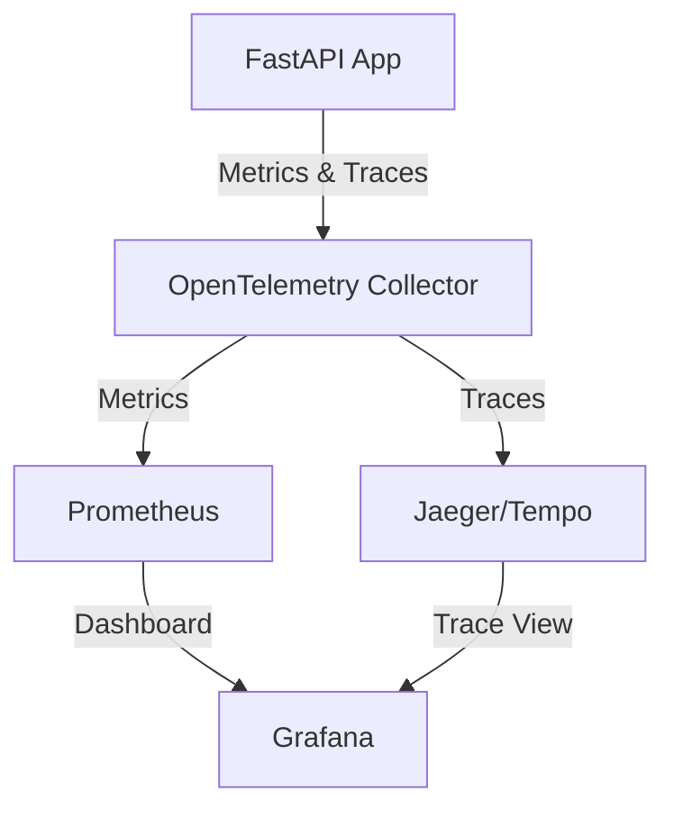

# MagFlow Monitoring Setup

This document describes the monitoring and observability setup for the MagFlow ERP system.

## Architecture



## Components

### 1. OpenTelemetry Integration

#### Configuration
- **Service Name**: `magflow-api`
- **Environment**: `production`/`development`
- **Exporters**:
  - OTLP (OpenTelemetry Protocol)
  - Console (for development)

#### Environment Variables
```bash
# Required
OTEL_SERVICE_NAME=magflow-api
OTEL_EXPORTER_OTLP_ENDPOINT=http://otel-collector:4317
OTEL_EXPORTER_OTLP_INSECURE=true

# Optional
OTEL_PYTHON_LOG_CORRELATION=true  # Enable trace context in logs
OTEL_PYTHON_DISABLED_INSTRUMENTATIONS=[]  # List of disabled instrumentations
```

### 2. Prometheus Metrics

#### Key Metrics
- `http_server_duration_seconds`: HTTP request duration in seconds
- `http_server_requests_total`: Total HTTP requests
- `http_server_request_size_bytes`: HTTP request size in bytes
- `http_server_response_size_bytes`: HTTP response size in bytes
- `http_server_active_requests`: Number of active requests

#### Scrape Configuration
Add to `prometheus.yml`:
```yaml
scrape_configs:
  - job_name: 'magflow-api'
    scrape_interval: 5s
    static_configs:
      - targets: ['magflow-api:8000']
    metrics_path: '/metrics'
```

### 3. Grafana Dashboard

#### Dashboard Panels
1. **Request Rate**
   - Requests per second by endpoint and method
   - Alerts on abnormal request patterns

2. **Response Latency**
   - p95 and p99 latency by endpoint
   - Alert on high latency

3. **Error Rate**
   - 5xx error rate
   - Alert on error rate spikes

4. **Service Status**
   - Service health and uptime
   - Instance status

#### Import Dashboard
1. Navigate to Grafana
2. Click "+" > "Import"
3. Upload `docker/grafana/provisioning/dashboards/magflow-dashboard.json`
4. Select Prometheus as the data source

## Testing the Setup

### 1. Generate Test Traffic
```bash
# Using hey for load testing
hey -n 1000 -c 10 http://localhost:8000/health

# Or with curl
for i in {1..100}; do
  curl -s http://localhost:8000/health > /dev/null
  sleep 0.1
done
```

### 2. Verify Metrics
```bash
# Check if metrics are being exposed
curl -s http://localhost:8000/metrics | grep http_server

# Check specific metric
curl -s http://localhost:8000/metrics | grep http_server_duration_seconds_count
```

### 3. Verify Traces
1. Open Jaeger UI at `http://localhost:16686`
2. Select `magflow-api` service
3. Click "Find Traces"

## Troubleshooting

### No Metrics Appearing
1. Check if the application is running
2. Verify the `/metrics` endpoint is accessible
3. Check OpenTelemetry collector logs
   ```bash
   docker-compose logs otel-collector
   ```

### High Latency
1. Check database query performance
2. Look for slow endpoints in the latency panel
3. Check for resource constraints (CPU/Memory)

### High Error Rate
1. Check application logs
2. Look for patterns in error types
3. Verify dependencies (database, Redis, etc.)

## Alerting

### Example Alert Rules
```yaml
# alert.rules
groups:
- name: magflow
  rules:
  - alert: HighErrorRate
    expr: rate(http_server_duration_seconds_count{status_code=~"5.."}[5m]) / rate(http_server_duration_seconds_count[5m]) > 0.05
    for: 5m
    labels:
      severity: critical
    annotations:
      summary: High error rate on {{ $labels.instance }}
      description: "Error rate is {{ $value }}% for {{ $labels.job }}"

  - alert: HighLatency
    expr: histogram_quantile(0.95, sum(rate(http_server_duration_seconds_bucket[1m])) by (le)) > 1
    for: 5m
    labels:
      severity: warning
    annotations:
      summary: High latency on {{ $labels.instance }}
      description: "95th percentile latency is {{ $value }}s"
```

## Performance Considerations

### Cardinality
Be cautious with high-cardinality labels as they can significantly impact Prometheus performance.

### Retention
Configure appropriate retention policies in Prometheus based on your storage capacity.

### Sampling
For high-traffic services, consider implementing sampling for traces to reduce overhead.

## Security

### Authentication
- Enable authentication for Grafana and Prometheus
- Use HTTPS for all endpoints
- Implement proper CORS policies

### Data Protection
- Be cautious with sensitive data in logs and metrics
- Use environment variables for secrets
- Regularly rotate API keys and certificates
